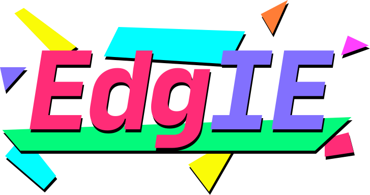

[](https://www.npmjs.com/package/postcss-edgie)

[](https://www.npmjs.com/package/postcss-edgie)

---

Edgie is a PostCSS plugin to easily target Edge and IE.

Built out of frustration with trying deal with specific Edge and IE issues in modern projects.

## Getting started

```
npm install --save postcss-edgie
```

## Usage

**postcss.config.js**

```
module.exports = {
  plugins: [
    require('postcss-edgie'),
  ],
}
```

**style.css**

##### Input

```
.button {
  background: red;

  @edgie {
    background: blue;
  }
}
```

##### Output

```
.button {
  background: red;
}

@supports (-ms-ime-align:auto) {
  .button {
    background: blue;
  }
}

@media screen and (-ms-high-contrast: active), (-ms-high-contrast: none) {
  .button {
    background: blue;
  }
}
```
